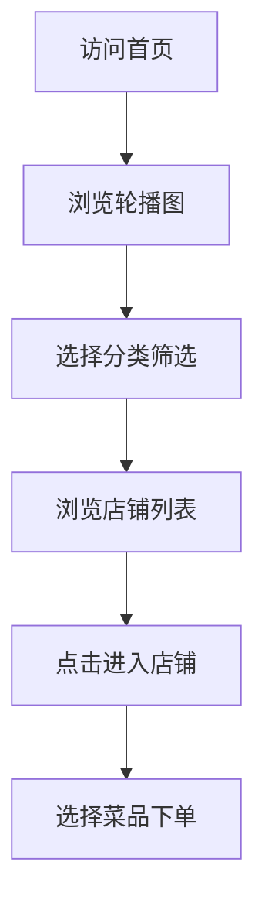
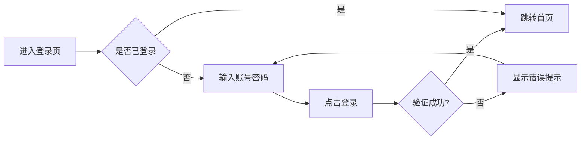

# 美味外卖平台 - 产品需求文档

## 1. 产品概述

美味外卖平台是一个现代化的外卖订餐Web应用，致力于为用户提供便捷、直观的在线订餐体验。平台整合了优质餐厅资源，通过精美的界面设计和流畅的用户交互，让用户能够轻松浏览菜品、下单订餐。

### 产品价值
- **用户价值**：节省外出就餐时间，随时随地获取美食
- **商业价值**：为餐厅提供线上曝光渠道，扩大服务范围
- **社会价值**：推动餐饮行业数字化转型，提升整体服务效率

## 2. 核心功能

### 2.1 用户角色
| 角色 | 注册方式 | 核心权限 |
|------|----------|----------|
| 访客用户 | 无需注册 | 浏览首页、查看店铺和菜品信息 |
| 注册用户 | 手机号注册 | 下单、收藏、管理个人信息 |

### 2.2 功能模块
1. **登录注册模块**：简洁的登录界面，支持用户身份验证
2. **首页展示模块**：轮播推广、店铺推荐、分类筛选、热门菜品
3. **公共导航模块**：顶部导航栏、底部版权信息
4. **店铺详情模块**：店铺信息卡片、配送信息展示

### 2.3 页面详情

#### 登录页面
| 模块名称 | 功能描述 | 交互特性 |
|---------|----------|----------|
| 登录表单 | 手机号、密码输入 | 表单验证、错误提示 |
| 登录按钮 | 提交登录请求 | 加载状态、点击反馈 |
| 注册链接 | 跳转注册页面 | 悬停高亮效果 |

#### 首页
| 模块名称 | 功能描述 | 交互特性 |
|---------|----------|----------|
| 顶部导航栏 | 页面导航、品牌标识 | 当前页面高亮、悬停效果 |
| 轮播图区域 | 餐厅促销、活动展示 | 自动轮播、手动切换、指示器 |
| 分类导航区 | 快速筛选菜品分类 | 点击筛选、分类图标展示 |
| 店铺列表区 | 展示可订餐店铺 | 卡片悬停效果、评分展示 |
| 推荐菜品区 | 热门菜品推荐 | 横向滚动、价格展示 |
| 底部信息栏 | 版权信息、联系方式 | 固定底部、响应式布局 |

## 3. 核心流程

### 3.1 用户浏览流程


### 3.2 用户登录流程


## 4. 用户界面设计

### 4.1 设计风格

#### 配色方案（暖色调）
- **主色调**：橙色系 (#FF6B35, #FF8C42, #FFA559)
- **辅助色**：暖黄色 (#FFD93D, #FFC300)
- **中性色**：深棕色 (#4A3728) 用于文字
- **背景色**：米白色 (#FFF8F0) 营造温暖氛围
- **强调色**：深橙色 (#E85A2C) 用于按钮和重点信息

#### 设计特点
- **圆润设计**：按钮、卡片采用圆角设计，传达友好感
- **阴影层次**：适度的阴影增加立体感和层次感
- **图标风格**：线性图标，颜色与主色调统一
- **字体选择**：
  - 标题：思源黑体 Bold / Noto Sans SC Bold
  - 正文：思源黑体 Regular / Noto Sans SC Regular
  - 价格：DIN Alternate Bold（数字醒目）

### 4.2 页面设计概览

#### 首页布局
```
┌─────────────────────────────────────┐
│           顶部导航栏                  │
│  Logo  │ 首页 │ 订单 │ 我的 │ 登录  │
├─────────────────────────────────────┤
│           轮播图区域                  │
│  ┌─────────────────────────────┐   │
│  │   自动轮播 · 指示器点       │   │
│  └─────────────────────────────┘   │
├─────────────────────────────────────┤
│           分类导航区                  │
│  [快餐] [中餐] [西餐] [甜点] [饮品]   │
├─────────────────────────────────────┤
│           店铺推荐区                  │
│  ┌────────┐  ┌────────┐            │
│  │ 店铺1  │  │ 店铺2  │            │
│  │ 评分   │  │ 评分   │            │
│  │ 起送价 │  │ 起送价 │            │
│  └────────┘  └────────┘            │
├─────────────────────────────────────┤
│           推荐菜品区                  │
│  ┌────┐ ┌────┐ ┌────┐ ┌────┐     │
│  │菜品│ │菜品│ │菜品│ │菜品│ →   │
│  └────┘ └────┘ └────┘ └────┘     │
├─────────────────────────────────────┤
│           底部信息栏                  │
│  Copyright © 2024 美味外卖           │
└─────────────────────────────────────┘
```

#### 登录页布局
```
┌─────────────────────────────────────┐
│                                     │
│                                     │
│           美味外卖平台               │
│           DELICIOUS FOOD            │
│                                     │
│        ┌─────────────────┐          │
│        │   手机号输入    │          │
│        └─────────────────┘          │
│        ┌─────────────────┐          │
│        │   密码输入      │          │
│        └─────────────────┘          │
│                                     │
│        ┌─────────────────┐          │
│        │     登 录      │          │
│        └─────────────────┘          │
│                                     │
│        还没有账号？立即注册          │
│                                     │
└─────────────────────────────────────┘
```

### 4.3 响应式设计

#### 断点设置
- **桌面端**：≥ 1200px，3-4列店铺卡片
- **平板端**：768px - 1199px，2列店铺卡片
- **移动端**：< 768px，单列布局，汉堡菜单

#### 适配策略
- **流式布局**：使用弹性盒子和网格布局
- **图片适配**：使用 srcset 和 picture 标签
- **字体缩放**：使用 rem 和视口单位
- **触摸优化**：移动端增大点击区域

## 5. 交互动效设计

### 5.1 轮播图动画
- **自动播放**：每5秒自动切换
- **过渡效果**：淡入淡出，时长500ms
- **指示器**：点击切换，当前高亮
- **悬停暂停**：鼠标悬停时停止自动播放

### 5.2 卡片交互
- **悬停效果**：上浮8px，增加阴影
- **点击反馈**：轻微缩放0.98
- **过渡时长**：200ms ease-out

### 5.3 页面加载
- **骨架屏**：内容区域显示加载占位
- **渐显动画**：内容淡入，时长300ms
- **加载指示器**：圆圈旋转动画

### 5.4 导航交互
- **高亮当前**：当前页面导航项高亮显示
- **悬停效果**：下划线滑入动画
- **点击反馈**：颜色变化过渡

## 6. 技术约束

### 6.1 浏览器兼容
- Chrome ≥ 90
- Firefox ≥ 88
- Safari ≥ 14
- Edge ≥ 90

### 6.2 性能要求
- 首屏加载时间 < 3秒
- 轮播图切换流畅，无卡顿
- 移动端60fps动画

### 6.3 可访问性
- 颜色对比度符合 WCAG 2.1 AA 标准
- 图片提供 alt 文本
- 键盘可导航
