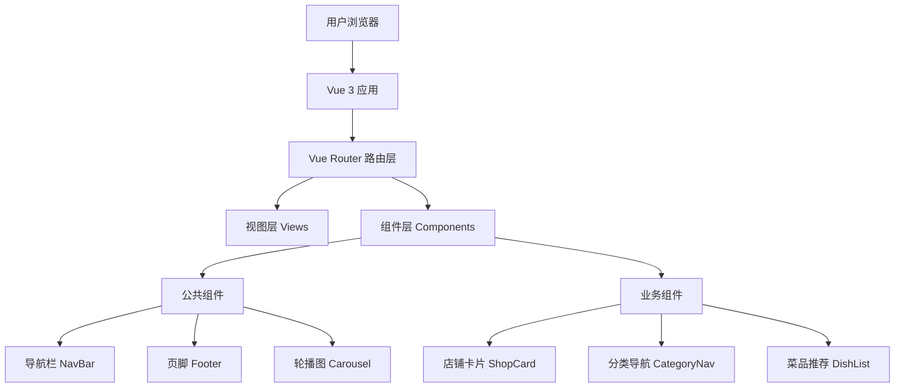
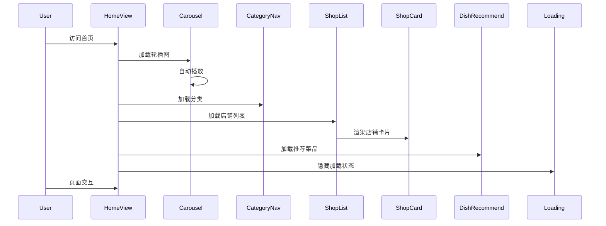

# 美味外卖平台 - 技术架构文档

## 1. 架构设计

### 1.1 整体架构


### 1.2 技术栈
- **前端框架**：Vue 3.4+ (Composition API)
- **路由管理**：Vue Router 4.x
- **构建工具**：Vite 5.x
- **开发语言**：TypeScript 5.x
- **样式方案**：CSS3 + CSS Variables
- **状态管理**：Pinia (可选，用于复杂状态)

## 2. 项目结构

```
DeliciousFood/
├── src/
│   ├── assets/              # 静态资源
│   │   ├── base.css         # 基础样式
│   │   ├── main.css         # 主样式文件
│   │   └── logo.svg        # Logo图标
│   │
│   ├── components/          # 公共组件
│   │   ├── common/          # 通用组件
│   │   │   ├── NavBar.vue   # 导航栏组件
│   │   │   ├── Footer.vue   # 页脚组件
│   │   │   ├── Carousel.vue # 轮播图组件
│   │   │   └── Loading.vue  # 加载状态组件
│   │   │
│   │   ├── shop/            # 店铺相关组件
│   │   │   ├── ShopCard.vue # 店铺卡片
│   │   │   └── ShopList.vue # 店铺列表
│   │   │
│   │   └── dish/            # 菜品相关组件
│   │       ├── CategoryNav.vue    # 分类导航
│   │       └── DishCard.vue       # 菜品卡片
│   │
│   ├── views/               # 页面视图
│   │   ├── LoginView.vue    # 登录页面
│   │   ├── HomeView.vue     # 首页
│   │   ├── ShopView.vue     # 店铺详情页
│   │   └── OrderView.vue    # 订单页面
│   │
│   ├── router/              # 路由配置
│   │   └── index.ts         # 路由定义和守卫
│   │
│   ├── stores/              # 状态管理
│   │   └── user.ts          # 用户状态
│   │
│   ├── services/            # 业务服务层
│   │   └── api.ts           # API接口封装
│   │
│   ├── utils/               # 工具函数
│   │   └── helpers.ts       # 辅助函数
│   │
│   ├── types/               # TypeScript类型定义
│   │   └── index.d.ts       # 全局类型声明
│   │
│   ├── App.vue              # 根组件
│   └── main.ts              # 应用入口
│
├── public/                  # 公共资源
│   └── favicon.ico         # 网站图标
│
├── index.html              # HTML模板
├── package.json            # 项目依赖
├── vite.config.ts          # Vite配置
├── tsconfig.json           # TypeScript配置
└── README.md               # 项目说明
```

## 3. 路由定义

### 3.1 路由配置表
| 路由路径 | 页面名称 | 组件 | 是否需要导航栏 | 说明 |
|---------|---------|------|--------------|------|
| /login | 登录页 | LoginView | 否 | 用户登录 |
| / | 首页 | HomeView | 是 | 主页轮播、店铺列表 |
| /shop/:id | 店铺详情 | ShopView | 是 | 店铺菜品详情 |
| /order | 订单页 | OrderView | 是 | 用户订单 |

### 3.2 二级路由架构
```
/                    # 一级路由 - 布局容器
├── /login           # 登录页（无布局）
└── /home            # 首页（主布局）
    ├── /home        # 首页内容
    ├── /shop/:id    # 店铺详情
    └── /order       # 订单管理
```

### 3.3 路由守卫逻辑
```typescript
// 路由守卫实现
router.beforeEach((to, from, next) => {
  const showNavFooter = to.meta.showNavFooter !== false;
  
  if (showNavFooter) {
    // 显示导航栏和页脚
    next();
  } else {
    // 登录页等特殊页面，不显示公共组件
    next();
  }
});
```

## 4. 组件设计

### 4.1 组件层级结构
```
App.vue
├── Layout.vue (布局容器)
│   ├── NavBar.vue (条件渲染)
│   ├── RouterView
│   │   ├── LoginView.vue
│   │   └── HomeView.vue
│   │       ├── Carousel.vue
│   │       ├── CategoryNav.vue
│   │       ├── ShopList.vue
│   │       │   └── ShopCard.vue
│   │       └── DishRecommend.vue
│   │           └── DishCard.vue
│   └── Footer.vue (条件渲染)
```

### 4.2 核心组件说明

#### NavBar.vue - 导航栏组件
- **功能**：提供页面导航、品牌展示、用户登录入口
- **Props**：
  - `logo`: string - Logo图片路径
  - `navItems`: Array - 导航项配置
- **Events**：
  - `@navigate` - 导航切换事件
- **特性**：
  - 当前路由高亮
  - 悬停下划线动画
  - 响应式折叠菜单

#### Carousel.vue - 轮播图组件
- **功能**：展示餐厅促销、活动信息
- **Props**：
  - `images`: Array - 图片列表
  - `interval`: number - 切换间隔(ms)
  - `height`: string - 轮播高度
- **Events**：
  - `@change` - 切换事件
- **特性**：
  - 自动轮播
  - 手动切换
  - 指示器点
  - 悬停暂停
  - 淡入淡出动画

#### ShopCard.vue - 店铺卡片组件
- **功能**：展示单个店铺信息
- **Props**：
  - `shop`: Shop - 店铺数据对象
- **Events**：
  - `@click` - 点击事件
- **特性**：
  - 悬停上浮效果
  - 评分星级展示
  - 配送信息展示

#### CategoryNav.vue - 分类导航组件
- **功能**：提供菜品分类快速筛选
- **Props**：
  - `categories`: Array - 分类列表
  - `selectedId`: number | string - 当前选中
- **Events**：
  - `@select` - 选择分类事件
- **特性**：
  - 图标+文字展示
  - 选中状态高亮
  - 横向滚动（移动端）

#### Footer.vue - 页脚组件
- **功能**：展示版权信息、联系方式
- **Props**：
  - `company`: string - 公司名称
  - `year`: number - 版权年份
- **特性**：
  - 固定底部
  - 响应式适配

## 5. 样式设计系统

### 5.1 CSS变量定义
```css
:root {
  /* 主色调 - 橙色系 */
  --primary-color: #FF6B35;
  --primary-light: #FF8C42;
  --primary-dark: #E85A2C;
  
  /* 辅助色 - 暖黄色 */
  --secondary-color: #FFD93D;
  --secondary-light: #FFC300;
  
  /* 中性色 */
  --text-primary: #4A3728;
  --text-secondary: #8B7355;
  --text-muted: #B8A898;
  
  /* 背景色 */
  --bg-primary: #FFF8F0;
  --bg-secondary: #FFFFFF;
  --bg-card: #FFFFFF;
  
  /* 阴影 */
  --shadow-sm: 0 2px 4px rgba(74, 55, 40, 0.08);
  --shadow-md: 0 4px 12px rgba(74, 55, 40, 0.12);
  --shadow-lg: 0 8px 24px rgba(74, 55, 40, 0.16);
  
  /* 圆角 */
  --radius-sm: 8px;
  --radius-md: 12px;
  --radius-lg: 16px;
  
  /* 过渡 */
  --transition-fast: 200ms ease-out;
  --transition-normal: 300ms ease-out;
  --transition-slow: 500ms ease-out;
}
```

### 5.2 响应式断点
```css
/* 移动端优先 */
@media screen and (min-width: 768px) {
  /* 平板端 */
}

@media screen and (min-width: 1200px) {
  /* 桌面端 */
}
```

## 6. 页面生命周期

### 6.1 首页加载流程


## 7. 数据模型

### 7.1 核心数据类型
```typescript
// 店铺数据
interface Shop {
  id: number;
  name: string;
  rating: number;
  sales: number;
  minimumOrder: number;
  deliveryFee: number;
  deliveryTime: string;
  image: string;
  categories: string[];
}

// 菜品数据
interface Dish {
  id: number;
  name: string;
  price: number;
  originalPrice?: number;
  image: string;
  sales: number;
  rating: number;
  shopId: number;
}

// 分类数据
interface Category {
  id: number;
  name: string;
  icon: string;
  count: number;
}

// 轮播图数据
interface CarouselItem {
  id: number;
  image: string;
  link?: string;
  title?: string;
}
```

## 8. 关键功能实现

### 8.1 路由守卫实现
- 使用 `router.beforeEach` 全局前置守卫
- 通过 `meta` 属性控制导航栏显示
- 登录页设置 `meta: { showNavFooter: false }`

### 8.2 轮播图实现
- 使用 `setInterval` 实现自动播放
- CSS `transition` 实现平滑动画
- 监听 `mouseenter/mouseleave` 实现悬停暂停

### 8.3 响应式实现
- CSS Grid 和 Flexbox 布局
- 媒体查询断点适配
- 图片 `object-fit` 保持比例

### 8.4 加载状态实现
- 组件 `v-if` 控制显示
- CSS `@keyframes` 动画
- 骨架屏提升用户体验
